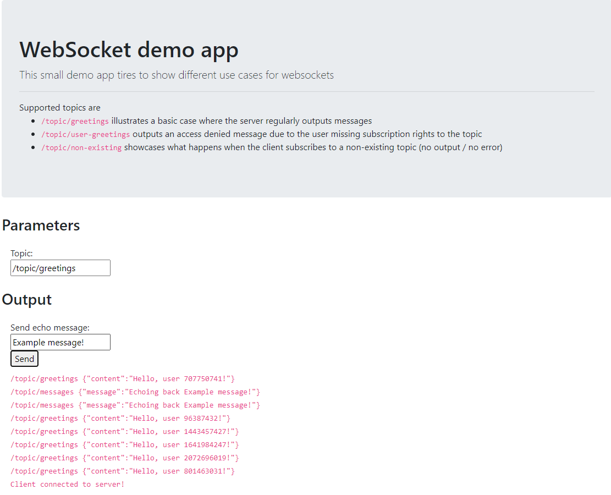

This is a personal project to experiment and learn how to use websockets in a Spring Boot app with a React frontend.

## Learning resources
* https://stomp.github.io/
* https://stomp-js.github.io/guide/stompjs/using-stompjs-v5.html
* https://spring.io/guides/gs/messaging-stomp-websocket/

## Project overview

You'll find two modules in this project: a client and a server.

The client uses React + Typescript in a standard create-react-app setup, while the server uses Spring (Boot) + Kotlin.

## Demo time

1. Start your Spring Boot based server by running `Server.kt` in the server project.
2. Start the react client by running `npm start` in the client project.
3. Open your browser at http://localhost:3000

